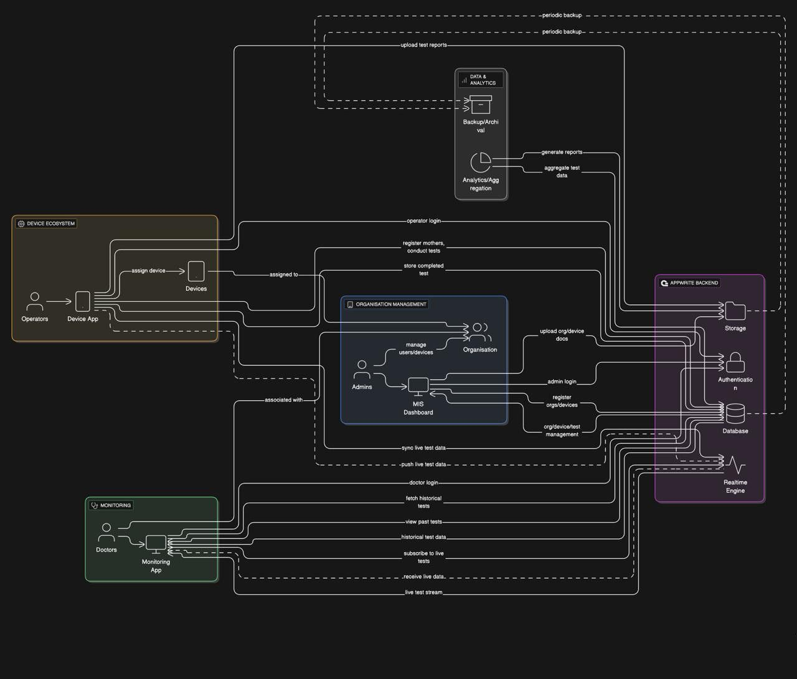
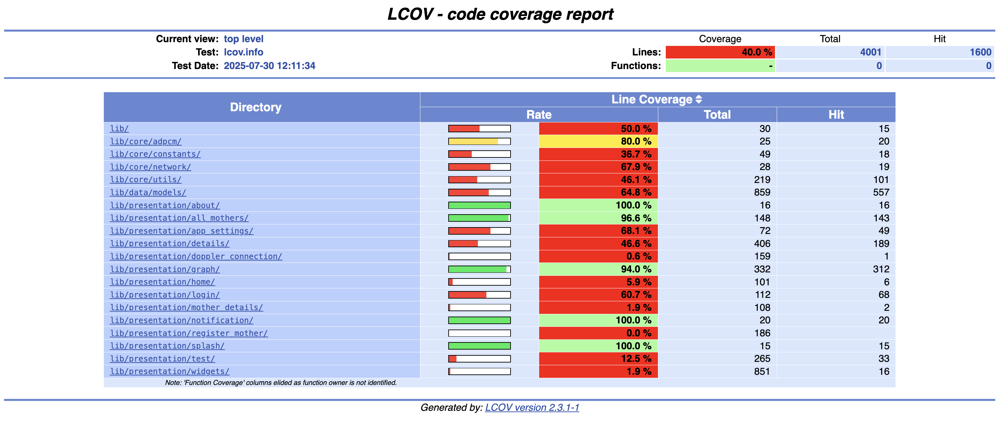

# 📱 Fetosense Device Flutter

[](https://discord.gg/aTBs7mCWgK)
[](LICENSE)
[](https://github.com/CareNX-Innovations-Pvt-Ltd/fetosense_device_flutter/commits/main)
[](https://github.com/CareNX-Innovations-Pvt-Ltd/fetosense_device_flutter/issues)
[](https://codecov.io/gh/CareNX-Innovations-Pvt-Ltd/fetosense_device_flutter)

A Flutter-based mobile application for interfacing with the Fetosense NST/CTG device—a portable, wireless fetal monitoring system developed by CareNX Innovations.

> 🛠️ This app is to be used with **[Fetosense Web Flutter](https://github.com/CareNX-Innovations-Pvt-Ltd/fetosense-web-flutter) and [Fetosense Remote App](https://github.com/CareNX-Innovations-Pvt-Ltd/fetosense_remote_flutter)**.

## 🚀 Features 

- Real-time monitoring of fetal heart rate and uterine contractions  
- Seamless Bluetooth connectivity with the Fetosense device  
- Intuitive and user-friendly interface  
- Secure data storage and retrieval  
- Support for patient data management

## 🛠️ Getting Started

### Prerequisites

- Flutter SDK (version 3.24.5)
- Dart SDK
- Android Studio
- A connected Fetosense device for testing

### Installation

```bash
git clone https://github.com/CareNX-Innovations-Pvt-Ltd/fetosense_device_flutter.git
cd fetosense_device_flutter
flutter pub get
flutter run
```

### Project Structure
```
lib/
├── core/                               # API integration services
    ├──adpcm/                           # ADPCM codec for audio processing
    ├──constants/                       # All string, api and app route constants used in the app
    ├──network/                         # appwrite configuration and dependency injection
    └──utils/                           # Utility functions and helpers
├── data/                               # Business logic components
     ├──models/                         # Data models
     └──repository_implementation       # Repository implementation for data access
├── domain/                             # Business logic components
    └──repository                       # Use cases for business logic
├── screens/                            # UI screens
├── presentation/                       # Views
    ├──pages/                           # Individual pages of the app
        ├──page_view                    # View for displaying page content
        ├──page_cubit                   # Cubit for page state management
        └──page_state                   # State management for pages
    ├──widgets/                         # Reusable widgets
    └──blocs/                           # State management using BLoC pattern
└── main.dart                           # Application entry point
```
## Deployment

### Android

1. Generate a keystore file:
   ```
   keytool -genkey -v -keystore fetosense.keystore -alias fetosense -keyalg RSA -keysize 2048 -validity 10000
   ```

2. Build the APK:
   ```
   flutter build apk --release
   ```

### iOS

1. Set up your iOS signing certificate in Xcode
2. Build the app:
   ```
   flutter build ios --release
   ```

## Contributing

1. Fork the repository
2. Create your feature branch (`git checkout -b feature/amazing-feature`)
3. Commit your changes (`git commit -m 'Add some amazing feature'`)
4. Push to the branch (`git push origin feature/amazing-feature`)
5. Open a Pull Request


## Developer Documentation

You can find the complete developer documentation [here](https://carenx-innovations-pvt-ltd.github.io/fetosense_device_flutter/).


## System Architecture Diagram


## Project Charter
You can find the project charter [here](https://github.com/CareNX-Innovations-Pvt-Ltd/fetosense_device_flutter/blob/code-documentation/Fetosense%20Project%20Charter%20-%20UNICEF.pdf)

## Test Coverage


## About CareNX Innovations

CareNX Innovations is a healthcare technology company focused on developing innovative solutions for maternal and fetal healthcare. The Fetosense device and companion applications are designed to improve access to quality healthcare for expectant mothers, especially in remote and underserved areas.

## Contact

CareNX Innovations Pvt. Ltd.
- Website: [https://www.carenx.com](https://www.carenx.com)
- Email: support@carenx.com

## Acknowledgments

- Thanks to all healthcare providers and mothers who provided feedback during development
- Flutter and Dart communities for excellent documentation and support

## 💬 Join Our Discord Community

Have questions, feedback, or want to contribute?  
Join our official **Discord server** to connect with developers, collaborators, and contributors:

[](https://discord.gg/aTBs7mCWgK)

> 💡 Whether you're here to report bugs, suggest features, or just say hi — we’d love to have you!
